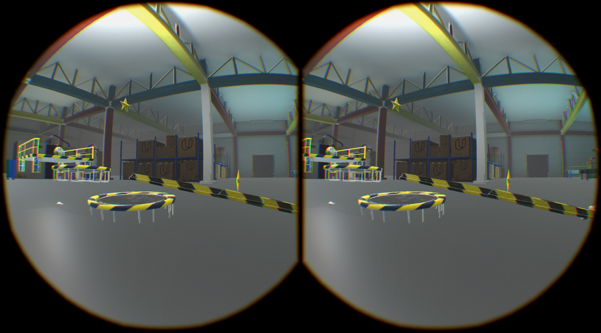
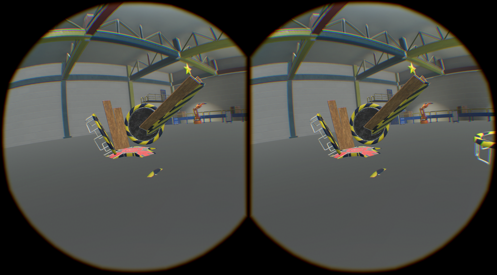
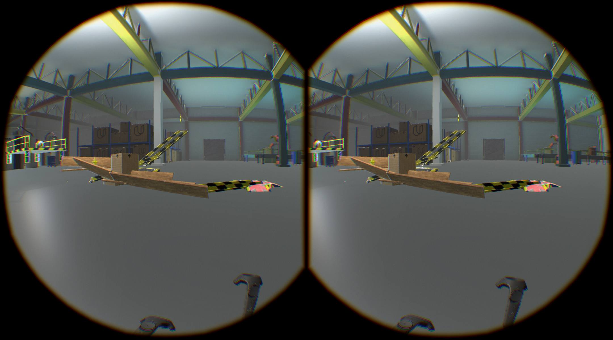

## VR Rube Goldberg Challenge 

### Platform

* Unity 2017.1.0p4

* SteamVR SDK

* Build for HTC Vive

### Level Difficulty

With only four levels, the difficulty of each level increases very fast. 

However, with unlimited building blocks, all levels are tested and surely beatable if you put time to it.

Some screenshots for your inspiration:

### Time Taken

8 hours